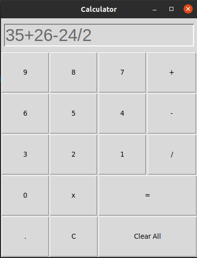

# Calculator-Python
A simple GUI version Python Calculator.
 
### Languages & tools :
[][py]
[][py]
  

|Calculator V1.0.2 |
|------|
||

### Directory Structure :     
    |-- Calculator_v0.1
    |   |-- Main.py
    |   |-- test.py
    |
    |-- Img
    |   |-- vscode.png
    |   |-- python.png
    |   |-- calculator_v1.0.2.png
    |
    |-- README.md

## Connect with me:  

  
 

[website]: https://abhilashtuofficial.github.io/
[py]: https://github.com/AbhilashTUofficial/Calculator-Python
